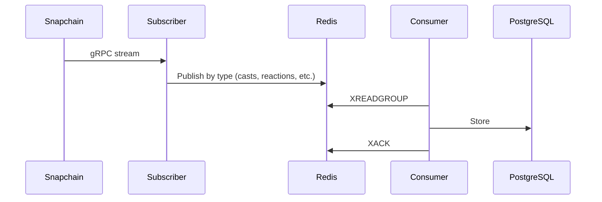
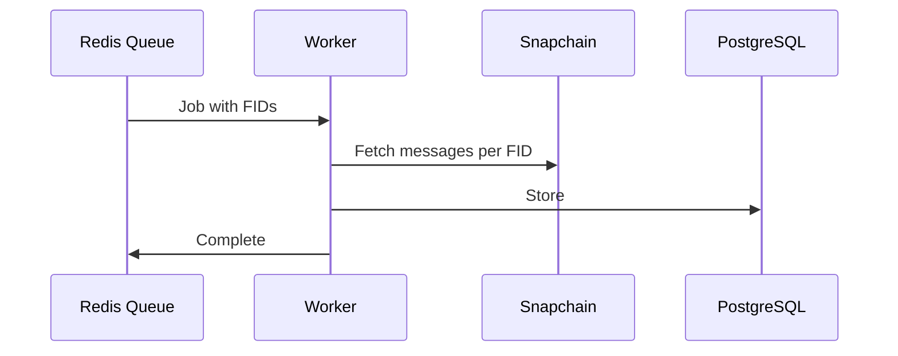
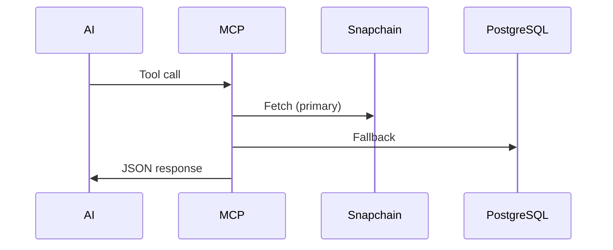
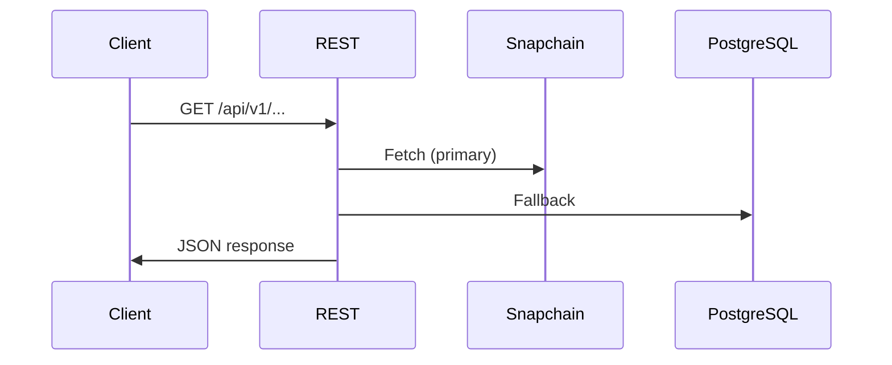

# Architecture

Four main components:
1. **Streaming** - Real-time Snapchain events via gRPC → Redis → PostgreSQL
2. **Backfill** - Historical data via queue/worker pattern
3. **MCP** - AI assistant data access
4. **REST API** - Read-only HTTP resource access

## External API Surfaces

| Surface | Protocol | Default Port | Base Path | Primary Clients |
|---|---|---|---|---|
| MCP | Streamable HTTP (MCP) | `8000` | `/mcp` | AI assistants and MCP clients |
| REST API | HTTP/JSON | `8081` | `/api/v1` | Services, dashboards, scripts |
| Health | HTTP | `8080` (`PORT`) | `/health` | Orchestrators and uptime probes |

## Service Modes

Waypoint supports three service modes for horizontal scaling:

```bash
waypoint start              # Both producer and consumer (default)
waypoint start producer     # Producer only: Hub → Redis
waypoint start consumer     # Consumer only: Redis → PostgreSQL
```

This enables independent scaling of producers and consumers via HPA or similar.

MCP and REST services are started only in `consumer` or `both` mode because they require database access.

## Streaming



**Flow:**
- Subscriber connects to Snapchain gRPC, filters spam, groups by type
- Redis streams provide durability and backpressure
- Consumer groups enable parallel processing
- Stale messages get reclaimed via XCLAIM

## Backfill



**Flow:**
- Queue service populates Redis with FID batches
- Workers pull jobs atomically (BRPOP)
- Each job reconciles all message types for its FIDs
- Multiple workers scale horizontally

## MCP



See [mcp.md](mcp.md) for tool details.

## REST API



See [rest.md](rest.md) for endpoint details.

## Data Access

Uses DataContext pattern with Hub-primary, DB-fallback strategy:

```
DataContext<DB, HC>
  ├── database: Option<DB>    # PostgreSQL
  └── hub_client: Option<HC>  # Snapchain gRPC
```

See [data-architecture.md](data-architecture.md) for schema.
